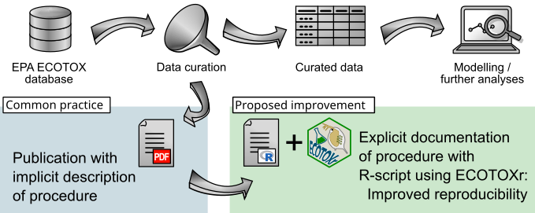

# `ECOTOXr`

<!-- badges: start -->

[](https://github.com/pepijn-devries/ECOTOXr/actions)
[](https://CRAN.R-project.org/package=ECOTOXr)
[](https://pepijn-devries.r-universe.dev/ECOTOXr)
 [](https://app.codecov.io/gh/pepijn-devries/ECOTOXr?branch=main)

<!-- badges: end -->

<a href="https://github.com/pepijn-devries/ECOTOXr/"></a>
`ECOTOXr` can be used to explore and analyse data from the [US EPA
ECOTOX database](https://cfpub.epa.gov/ecotox/). More specifically you
can:

- Build a local SQLite copy of the [US EPA ECOTOX
  database](https://cfpub.epa.gov/ecotox/)
- Search and extract data from the local database
- Use experimental features to search the on-line dashboards:
  [ECOTOX](https://cfpub.epa.gov/ecotox/search.cfm) and
  [CompTox](https://comptox.epa.gov/dashboard/batch-search)

## Why use `ECOTOXr`?

The `ECOTOXr` package allows you to search and extract data from the
[ECOTOXicological Knowledgebase](https://cfpub.epa.gov/ecotox/) and
import it directly into `R`. This will allow you to formalize and
document the search- and extract-procedures in `R` code. This makes it
easier to share and reproduce such procedures and its results. As
illustrated in the graphical abstract below. Moreover, you can directly
apply any statistical analysis offered in `R`.

<figure>

<figcaption aria-hidden="true">From
<a href="https://doi.org/10.1016/j.chemosphere.2024.143078">De Vries et
al. (2024)</a>;
<a href="https://creativecommons.org/licenses/by/4.0/">Creative
commons</a></figcaption>
</figure>

## Installation

> Get CRAN version

``` r
install.packages("ECOTOXr")
```

> Get development version from r-universe

``` r
install.packages("ECOTOXr", repos = c("https://pepijn-devries.r-universe.dev", "https://cloud.r-project.org"))
```

## Usage

### Preparing the database

Although `ECOTOXr` has experimental features to search the on-line
database. The package will reach its full potential when you build a
copy of the database on your local machine.

> Download and build a local copy of the latest ASCII export of the US
> EPA ECOTOX database

``` r
download_ecotox_data()
```

### Searching the local database for species and substances

Once built, you can search the local database for species and substances
using different strategies. You can use the build-in search function of
this package, or you can write custom queries using either the simple
query language (SQL) or `dplyr` verbs. More details in the following
vignettes: `vignette("searching-ecotox")` and
`vignette("ecotox-schema")`.

## Disclaimers

It is the end-users own responsibility to check the quality of collected
data, using the original referenced source in order to evaluate its
fitness for use, see also:
<https://cfpub.epa.gov/ecotox/help.cfm#info-limitations>.

Note that the package maintainer is not affiliated with the US EPA, this
package is therefore **not** official US EPA software.

## Resources

- De Vries, P. (2024) ECOTOXr: An R package for reproducible and
  transparent retrieval of data from EPA’s ECOTOX database.
  *Chemosphere* 364 143078
  <https://doi.org/10.1016/j.chemosphere.2024.143078>
- [Manual of the CRAN
  release](https://CRAN.R-project.org/package=ECOTOXr)
- EPA ECOTOX help <https://cfpub.epa.gov/ecotox/help.cfm>
- Olker, Jennifer H.; Elonen, Colleen M.; Pilli, Anne; Anderson, Arne;
  Kinziger, Brian; Erickson, Stephen; Skopinski, Michael; Pomplun,
  Anita; LaLone, Carlie A.; Russom, Christine L.; Hoff, Dale. (2022):
  The ECOTOXicology Knowledgebase: A Curated Database of Ecologically
  Relevant Toxicity Tests to Support Environmental Research and Risk
  Assessment. *Environmental Toxicology and Chemistry* 41(6) 1520-1539
  <https://doi.org/10.1002/etc.5324>
