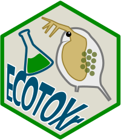

> `{ECOTOXr}` Harness information from the [US EPA ECOTOXicology
> Knowledgebase](https://www.epa.gov/ecotox/) [](https://github.com/pepijn-devries/ECOTOXr/actions)
> [](https://CRAN.R-project.org/package=ECOTOXr)
> 

## Overview

<a href="https://github.com/pepijn-devries/ECOTOXr/"></a>
`{ECOTOXr}` *TODO*

-   Build a local SQLite copy of the US EPA ECOTOX database
-   Search and extract data from the database

## Why use `{ECOTOXr}`?

*TODO*

## Installation

> Get CRAN version

``` r
install.packages("ECOTOXr")
```

> Get development version on github

``` r
devtools::install_github('pepijn-devries/ECOTOXr')
```

## Resources

-   EPA ECOTOX help <https://www.epa.gov/ecotox/help.cfm>
-   Olker, Jennifer H.; Elonen, Colleen M.; Pilli, Anne; Anderson, Arne;
    Kinziger, Brian; Erickson, Stephen; Skopinski, Michael; Pomplun,
    Anita; LaLone, Carlie A.; Russom, Christine L.; Hoff, Dale. (2022):
    The ECOTOXicology Knowledgebase: A Curated Database of Ecologically
    Relevant Toxicity Tests to Support Environmental Research and Risk
    Assessment. *Environmental Toxicology and Chemistry* 41(6) 1520-1539
    <https://doi.org/10.1002/etc.5324>
