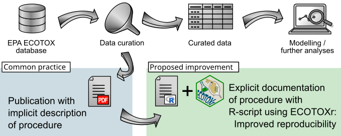

```{r, include = FALSE}
knitr::opts_chunk$set(
  collapse = TRUE,
  comment = "#>"
)
```

Reproducibility is a cornerstone of modern science. This, in combination with a growing demand
for the application of [FAIR Guiding Principles for scientific data management and stewardship](https://doi.org/10.1038/sdata.2016.18), has led to the development of the `ECOTOXr`
package. The EPA ECOTOX database provides the means to reuse data for multiple purposes.
However, studies that use curated data from this database often describe the process of curating
data implicitly or not at all. [De Vries (2024)](https://doi.org/10.1016/j.chemosphere.2024.143078)
proposes to explicitly document data curation process in the form of an R script. Where the
`ECOTOXr` package can be used to streamline this R code.



## Rules of thumb

[De Vries (2024)](https://doi.org/10.1016/j.chemosphere.2024.143078) provides some rules of
thumb for improving the reproducibility of your research when using the ECOTOXr package.
These rules are repeated here with some explanation. Quoted text below is from
[De Vries (2024)](https://doi.org/10.1016/j.chemosphere.2024.143078):

*"... transparency and reproducibility is optimised when:"*

  * *"An official package release from the CRAN repository is used and cited (including
    the version of the package and the database used: `cite_ecotox()`)."*
    By using the CRAN release you ensure that the version you use has passed all
    checks and balances required for a CRAN submission. If you need the latest features
    from the development version on [GitHub](https://github.com/pepijn-devries/ECOTOXr/)
    or [r-universe](https://pepijn-devries.r-universe.dev/ECOTOXr), you could refer
    to it by mentioning it's latest commit. You could also send a request to the maintainer
    to submit the development version to CRAN.
  * *"It is asserted that the local copy of the database is clean and unaltered (build a
    fresh copy when in doubt by using `download_ecotox_data()`)."*
    The locally built copy of the database is a 'simple' SQLite database located at
    `get_ecotox_path()` (or elsewhere if specified by the user). The package only writes
    to this database while building it from the downloaded files. All other operations
    are read-only. However, there is nothing stopping the user to write to the database.
    In fact, it can be considered one of the features of this package. It allows you to
    add additional (meta)data to the database. But, if you want to ensure reproducibility,
    you must make sure that the database is not corrupted or data is overwritten. In other
    words: be careful.
  * *"Only non-accented alphanumerical characters are used in search terms (as other
    characters may not reproduce well on different systems)."* The text files used
    to build the local database are assumed to be encoded in
    [UTF-8](https://en.wikipedia.org/wiki/UTF-8). While parsing the files non-convertable
    bytes are substituted with asterisk symbols. Furthermore, formulating search texts
    containing exotic characters may result in platform-dependent results. This is
    why using only non-accented alphanumerical characters in searches is recommended. Just
    to make sure...
  * *"The scripting code used for searching and subsetting the database is documented
    and it includes database record identifiers (and possibly the date modified)."*
    This one seems obvious. If you want others to reproduce your work, provide them the
    R script you used. Also, by recording identifiers ('result_id', 'test_id', etc.)
    others can check if they are working with an identical set of results. It is also
    wise to include information on when data was last modified in the database. This
    could also affect your results.

For more details and some demonstrations using case studies, please read
[De Vries (2024)](https://doi.org/10.1016/j.chemosphere.2024.143078).